# AUIND-Docker-DevOps-Lab-Cmarquez-advanced

#Autor: Carlos Marquez 12:16PM 22May26

#Con este nuevo repositorio vamos a hacer lo mismo que en el anterior pero lo haremos mas limpio y sin tantas carpetas:

    Estructura:
        
            laboratorio-docker-cmarquez/
            │
            ├─ docker-compose.yml
            ├─ dynamic.yml
            ├─ certs.yml
            ├─ index.html
            └─ certs/
                ├─ cert.pem
                └─ key.pem

    Primero crearemos un carpeta llamada certs y aqui guardaremos nuestros certificados que creamos y quedarian asi:

        cert.pem
        key-pem

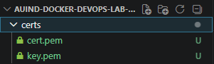

    Despues creamos el docker-compose.yml con el siguiente bloque de codigo:

        services:
            traefik:
                image: traefik:v2.10
                container_name: traefik

                command:
                - "--api.dashboard=true"
                - "--api.insecure=false"

                - "--entrypoints.web.address=:80"
                - "--entrypoints.websecure.address=:443"

                # SOLO file provider
                - "--providers.file.filename=/etc/traefik/dynamic.yml"

                - "--log.level=DEBUG"

                ports:
                - "80:80"
                - "443:443"

                volumes:
                - ./dynamic.yml:/etc/traefik/dynamic.yml:ro
                - ./certs:/certs:ro

                networks:
                - proxy

            web:
                image: nginx:latest
                container_name: web

                volumes:
                - ./index.html:/usr/share/nginx/html/index.html:ro

                ports:
                - "8088:80"

                networks:
                - proxy

            mailhog:
                image: mailhog/mailhog
                container_name: mailhog

                ports:
                - "1025:1025"
                - "8025:8025"

                networks:
                - proxy

            portainer:
                image: portainer/portainer-ce:latest
                container_name: portainer

                command: -H unix:///var/run/docker.sock

                volumes:
                - /var/run/docker.sock:/var/run/docker.sock
                - portainer_data:/data

                ports:
                - "9000:9000"

                networks:
                - proxy

            redis:
                image: redis:7-alpine
                container_name: redis

                ports:
                - "6379:6379"

                volumes:
                - redis_data:/data

                networks:
                - proxy

        volumes:
            portainer_data:
            redis_data:

        networks:
            proxy:
                driver: bridge

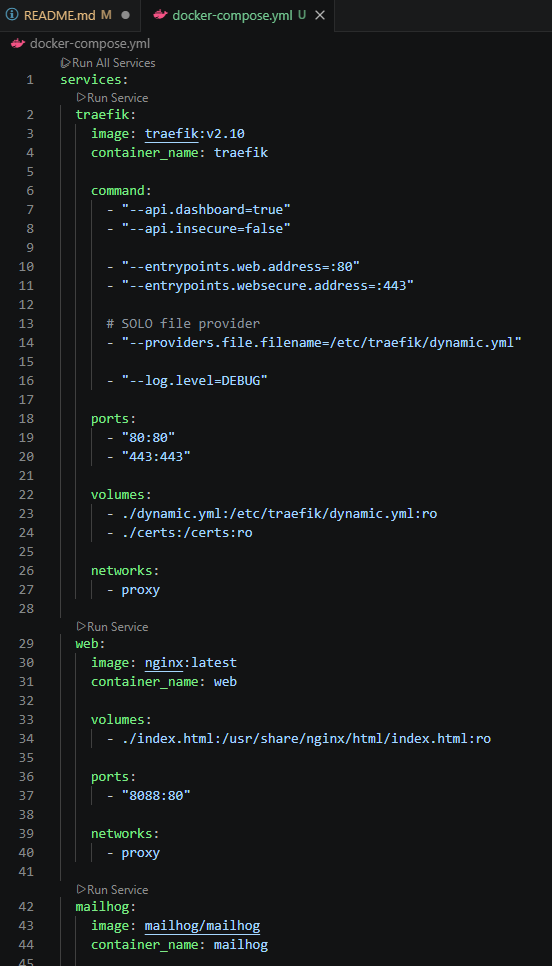
============================================================================
#Autor: Carlos Marquez 12:27PM 22May26

#Ahora Crearemos el archivo dynamic.yml, ya que sin el no es posible seguir con HTTPS ya que lanzaba una serie de errores y con esto se evitan este archivo que lleva el siguiente bloque de codigo:

        http:
            routers:
                web:
                rule: "Host(`app.midominio.com`)"
                entryPoints:
                    - websecure
                service: web-service
                tls: {}

                mailhog:
                rule: "Host(`mail.midominio.com`)"
                entryPoints:
                    - websecure
                service: mailhog-service
                tls: {}

                portainer:
                rule: "Host(`portainer.midominio.com`)"
                entryPoints:
                    - websecure
                service: portainer-service
                tls: {}

                dashboard:
                rule: "Host(`dashboard.midominio.com`)"
                entryPoints:
                    - websecure
                service: api@internal
                tls: {}

            services:
                web-service:
                loadBalancer:
                    servers:
                    - url: "http://host.docker.internal:8088"

                mailhog-service:
                loadBalancer:
                    servers:
                    - url: "http://host.docker.internal:8025"

                portainer-service:
                loadBalancer:
                    servers:
                    - url: "http://host.docker.internal:9000"

            tls:
            certificates:
                - certFile: /certs/cert.pem
                keyFile: /certs/key.pem
============================================================================
#Autor: Carlos Marquez 12:34PM 22May26

#Ahora seguimos con la creación del archivo index.html, solo para que se muestre una pagina, esta misma la creamos con un poco de ayuda de la IA y aqui se muestra el codigo:

        <!DOCTYPE html>
        <html lang="es">
        <head>
        <meta charset="UTF-8" />
        <meta name="viewport" content="width=device-width, initial-scale=1.0" />
        <title>Docker + Traefik</title>
        
        </head>
        <body>
        

            <h1>🚀 Hola Carlos Márquez</h1>
            
Estás dentro de Docker Compose.

            
Tu entorno local está funcionando correctamente con Traefik.

            
Arquitectura local con HTTPS, subdominios y múltiples servicios ✅

        

        </body>
        </html>
============================================================================
#Autor: Carlos Marquez 12:39PM 22May26

#En esta seccion levantaremos todos los servicios con los comandos siguientes:

        docker compose up -d

Y probamos las paginas en el navegador:
        https://app.midominio.com

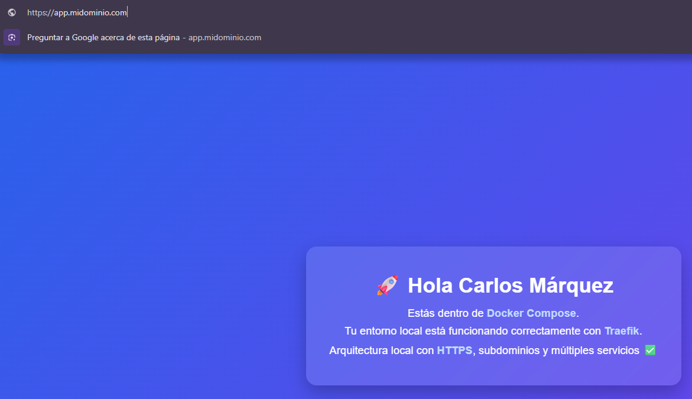

        https://mail.midominio.com

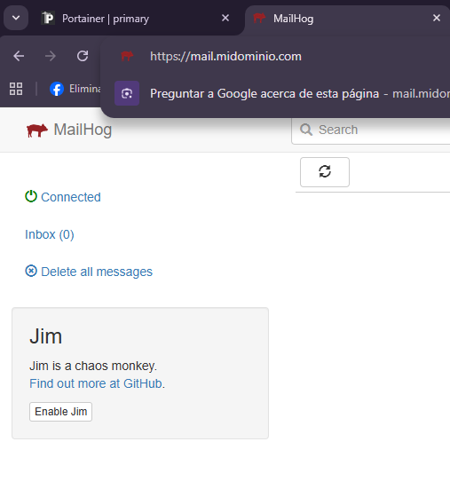

        https://portainer.midominio.com

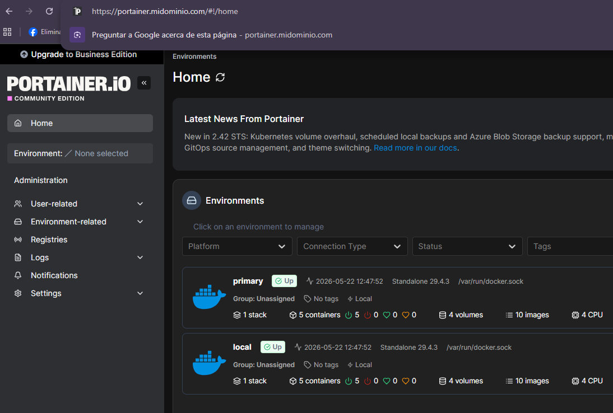

        https://dashboard.midominio.com

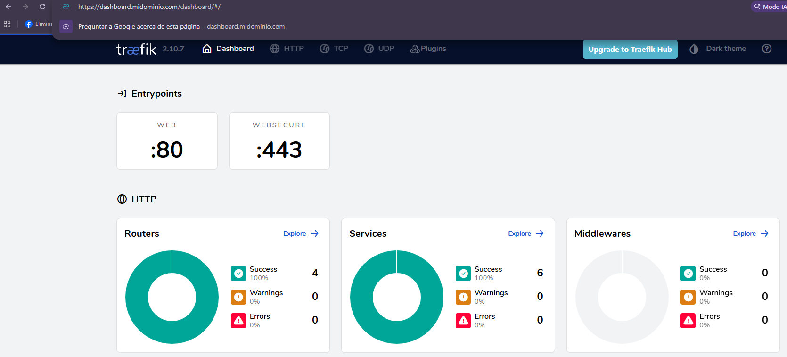
============================================================================
#Autor: Carlos Márquez 01:27PM 22May26

#PostgresSQL, Adminer, MySQL y phpMyAdmin

Lo primero que haremos sera actualizar el archivo "docker-compose.yml" y agregaremos las lineas de los servicios PostgresSQL, Adminer, MySQL y phpMyAdmin y nos quedara de la siguiente manera:

        services:
            traefik:
                image: traefik:v2.10
                container_name: traefik

                command:
                - "--api.dashboard=true"
                - "--api.insecure=false"

                - "--entrypoints.web.address=:80"
                - "--entrypoints.websecure.address=:443"

                # Redirección automática HTTP -> HTTPS
                - "--entrypoints.web.http.redirections.entrypoint.to=websecure"
                - "--entrypoints.web.http.redirections.entrypoint.scheme=https"

                # Solo file provider
                - "--providers.file.filename=/etc/traefik/dynamic.yml"

                - "--log.level=DEBUG"

                ports:
                - "80:80"
                - "443:443"

                volumes:
                - ./dynamic.yml:/etc/traefik/dynamic.yml:ro
                - ./certs:/certs:ro

                networks:
                - proxy

            web:
                image: nginx:latest
                container_name: web

                volumes:
                - ./index.html:/usr/share/nginx/html/index.html:ro

                networks:
                - proxy

            mailhog:
                image: mailhog/mailhog
                container_name: mailhog

                ports:
                - "1025:1025"

                networks:
                - proxy

            portainer:
                image: portainer/portainer-ce:latest
                container_name: portainer

                command: -H unix:///var/run/docker.sock

                volumes:
                - /var/run/docker.sock:/var/run/docker.sock
                - portainer_data:/data

                networks:
                - proxy

            postgres:
                image: postgres:16
                container_name: postgres

                environment:
                POSTGRES_DB: laboratorio
                POSTGRES_USER: admin
                POSTGRES_PASSWORD: admin123

                volumes:
                - postgres_data:/var/lib/postgresql/data

                networks:
                - proxy

            adminer:
                image: adminer:latest
                container_name: adminer

                networks:
                - proxy

            mysql:
                image: mysql:8
                container_name: mysql

                environment:
                MYSQL_ROOT_PASSWORD: root123
                MYSQL_DATABASE: wordpress
                MYSQL_USER: wpuser
                MYSQL_PASSWORD: wp123

                volumes:
                - mysql_data:/var/lib/mysql

                networks:
                - proxy

            phpmyadmin:
                image: phpmyadmin/phpmyadmin
                container_name: phpmyadmin

                environment:
                PMA_HOST: mysql
                PMA_PORT: 3306

                networks:
                - proxy

            redis:
                image: redis:7-alpine
                container_name: redis

                ports:
                - "6379:6379"

                volumes:
                - redis_data:/data

                networks:
                - proxy

            volumes:
            portainer_data:
            postgres_data:
            mysql_data:
            redis_data:

            networks:
            proxy:
                driver: bridge
    
    De este mismo modo tambien agregaremos lo necesario en nuestro archivo "dynamic.yml" lo cual queda de la siguiente manera:

            http:
                routers:
                    web:
                    rule: "Host(`app.midominio.com`)"
                    entryPoints:
                        - websecure
                    service: web-service
                    tls: {}

                    mailhog:
                    rule: "Host(`mail.midominio.com`)"
                    entryPoints:
                        - websecure
                    service: mailhog-service
                    tls: {}

                    portainer:
                    rule: "Host(`portainer.midominio.com`)"
                    entryPoints:
                        - websecure
                    service: portainer-service
                    tls: {}

                    adminer:
                    rule: "Host(`adminer.midominio.com`)"
                    entryPoints:
                        - websecure
                    service: adminer-service
                    tls: {}

                    phpmyadmin:
                    rule: "Host(`phpmyadmin.midominio.com`)"
                    entryPoints:
                        - websecure
                    service: phpmyadmin-service
                    tls: {}

                    dashboard:
                    rule: "Host(`dashboard.midominio.com`)"
                    entryPoints:
                        - websecure
                    service: api@internal
                    tls: {}

                services:
                    web-service:
                    loadBalancer:
                        servers:
                        - url: "http://web:80"

                    mailhog-service:
                    loadBalancer:
                        servers:
                        - url: "http://mailhog:8025"

                    portainer-service:
                    loadBalancer:
                        servers:
                        - url: "http://portainer:9000"

                    adminer-service:
                    loadBalancer:
                        servers:
                        - url: "http://adminer:8080"

                    phpmyadmin-service:
                    loadBalancer:
                        servers:
                        - url: "http://phpmyadmin:80"

                tls:
                certificates:
                    - certFile: /certs/cert.pem
                    keyFile: /certs/key.pem

    Ya que tengamos todo lo que haremos es dar de baja todo, eliminar y volver a crear los contenedores con los siguientes comandos:

        docker stop $(docker ps -q)
        docker rm $(docker ps -aq)
        docker compose up -d 

    Agregaremos al archivo hosts lo necesario y queda asi:

        127.0.0.1 app.midominio.com
        127.0.0.1 mail.midominio.com
        127.0.0.1 portainer.midominio.com
        127.0.0.1 adminer.midominio.com
        127.0.0.1 phpmyadmin.midominio.com
        127.0.0.1 dashboard.midominio.com

    Los datos que se usaran para ingresar a Postgres son los siguientes:

        System: PostgreSQL
        Server: postgres
        Username: admin
        Password: admin123
        Database: laboratorio

    y para phpMyAdmin son los siguientes:

        usa:
            Servidor: normalmente ya tomará mysql
            Usuario: root
            Contraseña: root123

        O también puedes usar:

            Usuario: wpuser
            Contraseña: wp123

    y veremos algo como lo siguiente:

        #PostgresSQL:

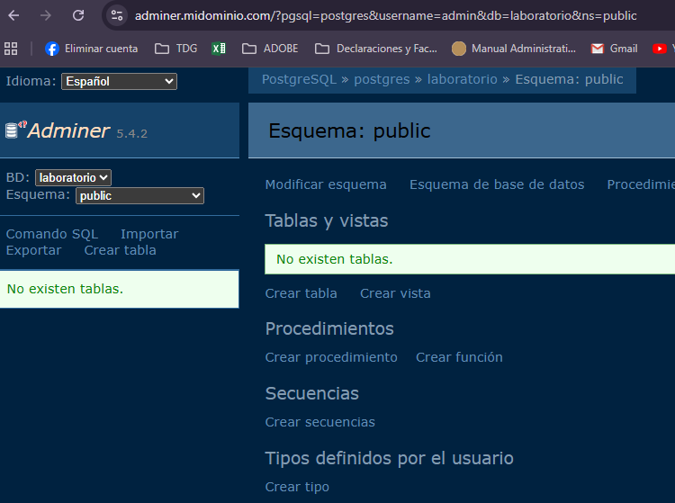

        #phpMyAdmin:

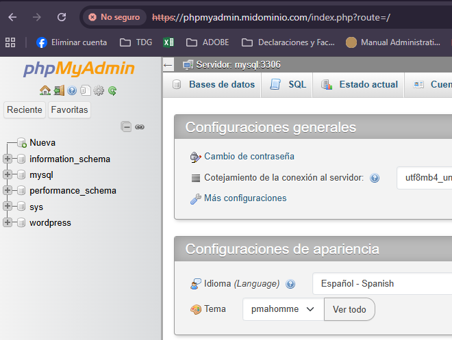

============================================================================
#Autor: Carlos Márquez 01:54PM 22May26

#En esta ocacion instalaremos WordPress como nuestro blog usando un subdominio blog.midominio.com y comenzaremos modificando nuestro docker-compose.yml y lo que haremos sera lo siguiente:

    Añadiremos el siguiente bloque en el apartado de Services:

            wordpress:
            image: wordpress:latest
            container_name: wordpress

            environment:
            WORDPRESS_DB_HOST: mysql:3306
            WORDPRESS_DB_NAME: wordpress
            WORDPRESS_DB_USER: wpuser
            WORDPRESS_DB_PASSWORD: wp123

            volumes:
            - wordpress_data:/var/www/html

            networks:
            - proxy

    Despues abajo en volumes agregamos lo siguiente:

        wordpress_data:

    Ahora actualizaremos el archivo dynamic.yml y agregamos lo siguiente:

            
        wordpress:
            rule: "Host(`blog.midominio.com`)"
            entryPoints:
                - websecure
            service: wordpress-service
            tls: {}

    Y en el apartado de services agregamos lo siguiente:

        wordpress-service:
            loadBalancer:
                servers:
                - url: "http://wordpress:80"    

    y volvemos a detener, eliminar y volver a dar de alta los servicios:

        docker stop $(docker ps -q)
        docker rm $(docker ps -aq)
        docker compose up -d 

    y probamos ingresando a la web:

        https://blog.midominio.com

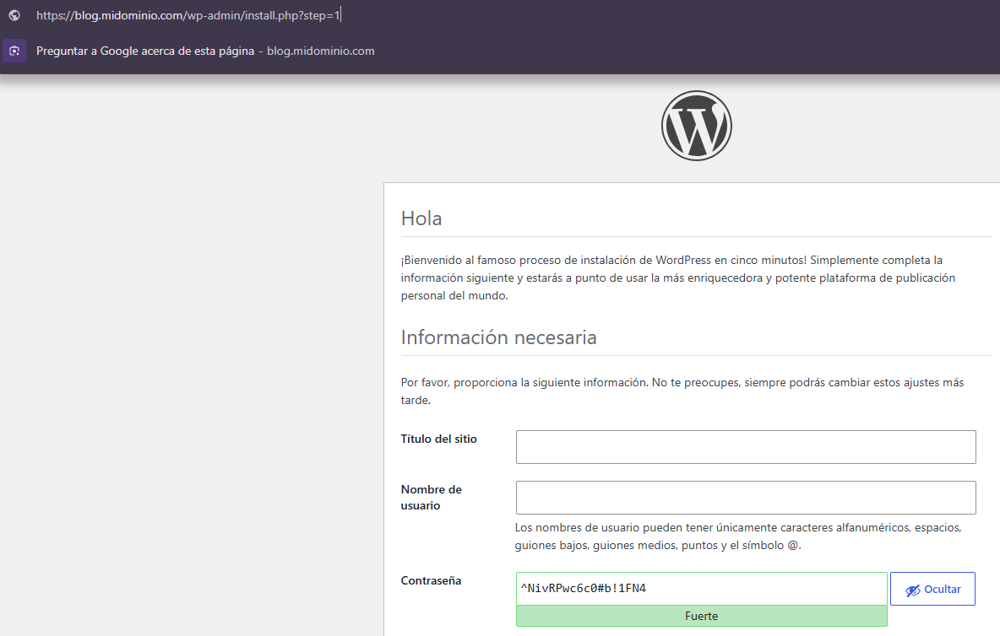
============================================================================
#Autor: Carlos Márquez 02:14PM 22May26

#Lo que sigue es hacer el balanceo de carga para hacer esto y hacerlo visual se agregaran 3 carpetas con un archivo index.html en su interior y con diferente color y Labels para que se identifique que realmente este haciendo el balanceo:

#Dentro de la carpeta principal se agregan 3 carpetas con su respectivo index.html

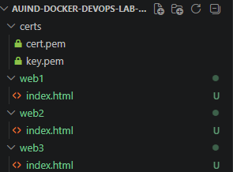

#Actualizamos nuestro docker-compose.yml:

#De:

            web:
            image: nginx:latest
            container_name: web

#A:

            web1:
                image: nginx:latest
                container_name: web1

                volumes:
                - ./web1/index.html:/usr/share/nginx/html/index.html:ro

                networks:
                - proxy

            web2:
                image: nginx:latest
                container_name: web2

                volumes:
                - ./web2/index.html:/usr/share/nginx/html/index.html:ro

                networks:
                - proxy

            web3:
                image: nginx:latest
                container_name: web3

                volumes:
                - ./web3/index.html:/usr/share/nginx/html/index.html:ro

                networks:
                - proxy
    
    
#Actualizamos en archivo dynamic.yml:

#y pasamos de esto:
                web-service:
                    loadBalancer:
                        servers:
                        - url: "http://web:80"
        
#A esto:

                web-service:
                    loadBalancer:
                        servers:
                        - url: "http://web1:80"
                        - url: "http://web2:80"
                        - url: "http://web3:80"

#Reiniciamos:

            docker stop $(docker ps -q)
            docker compose up -d

#Y para hacer la prueba solo ingresamos a la pagina https://app.midominio.com y la recargamos varias veces para ver los cambios:

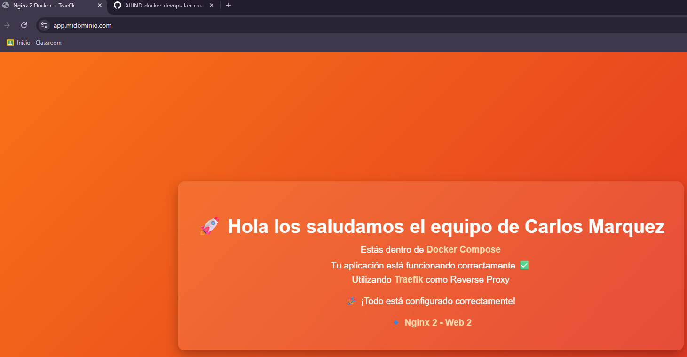
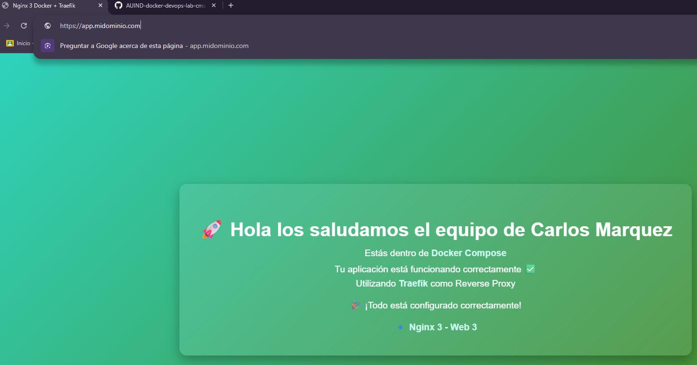

